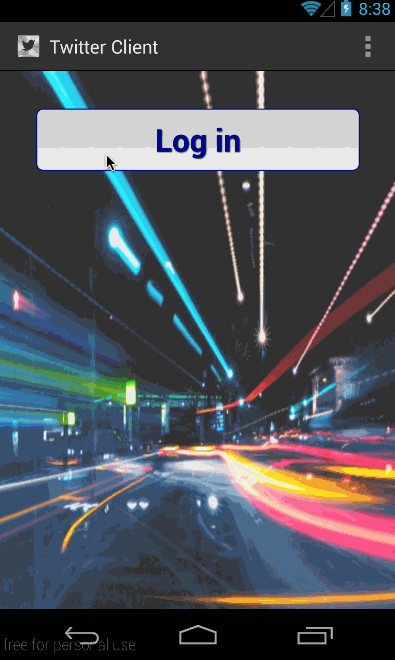

User Stories:

The following user stories must be completed:

* [x] Required:User can sign in to Twitter using OAuth login
* [x] Required:User can view the tweets from their home timeline
* [x] Required:User should be able to see the username, name, body and timestamp for each tweet
* [x] Required:User should be displayed the relative timestamp for a tweet "8m", "7h"
* [x] Required:User can compose a new tweet
* [x] Required:User can click a “Compose” icon in the Action Bar on the top right
* [x] Required:User can then enter a new tweet and post this to twitter
* [x] Required:User can view more tweets as they scroll with infinite pagination
* [x] Required:User is taken back to home timeline with new tweet visible in timeline
* [x] Bonus: Compose activity is replaced with a modal overlay
* [x] Optional: User can see a counter with total number of characters left for tweet
* [x] Optional: Links in tweets are clickable and will launch the web browser (see autolink)
* [x] Advanced: User can refresh tweets timeline by pulling down to refresh (i.e pull-to-refresh)
* [x] Advanced: User can open the twitter app offline and see last loaded tweets
	Tweets are persisted into sqlite and can be displayed from the local DB

The following advanced user stories are optional:

Advanced: User can tap a tweet to display a "detailed" view of that tweet
Advanced: User can select "reply" from detail view to respond to a tweet
Advanced: Improve the user interface and theme the app to feel "twitter branded"
Bonus: User can see embedded image media within the tweet detail view
